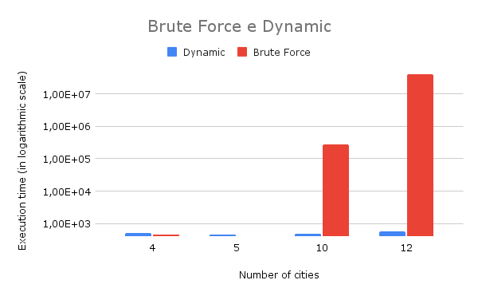

# Adjacency Matrix  

The "smart way" we employed operates with a single list, utilized solely to construct a matrix with the inputs, known as the "Adjacency Matrix." It has a size of $(\text{number of cities}) \times (\text{number of cities})$. Each element $M_{ij}$ denotes the distance from city $i$ to $j$ (or from $j$ to $i$, as they are the same). The program iteratively selects the shortest path for each city. After obtaining this initial route, it optimizes it by attempting to replace one city with a neighboring city, one at a time, analyzing whether the cost increases or not. This loop of changes runs "the number of cities" times, and the program then prints the route that resulted in the lowest cost.

Just like the brute force approach, this code also follows a complexity of O($n^2$); however, the constant multiplying $n^2$ is much smaller. Below is a comparative graph between the brute force and dynamic programming methods:

  

Note that the graph is presented on a logarithmic scale, highlighting the significantly longer runtime of the brute force method. For instance, the test case of 12 cities took 39 seconds for the brute force method, while the adjacent matrix method had an execution time of less than a second.

As expected, theory and practice have aligned, substantiating through experience that the brute force method is indeed slower. Not only in asymptotic big O analysis but also visually for tangible cases.
